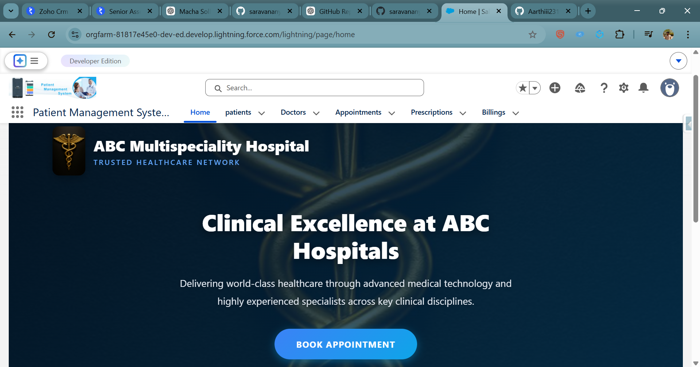
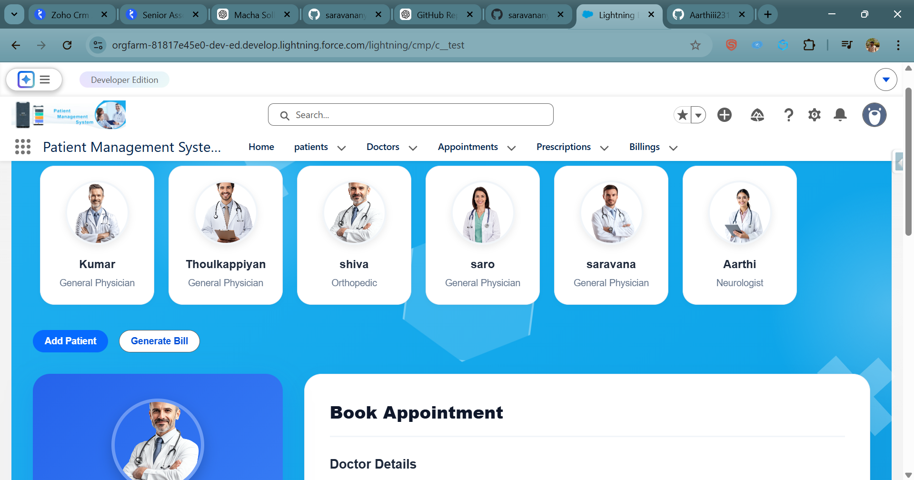
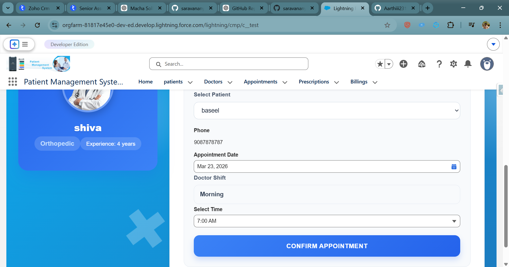
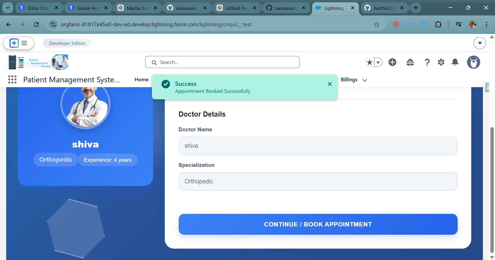
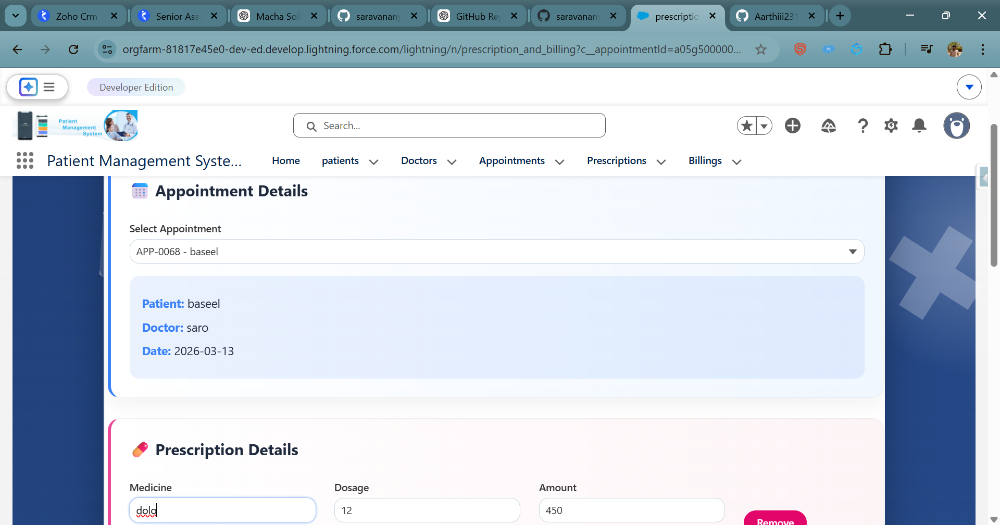
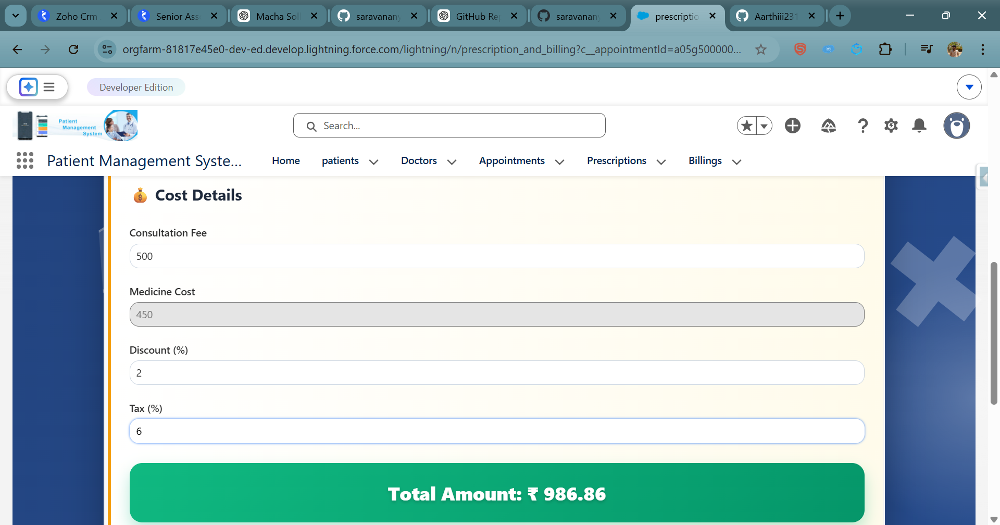
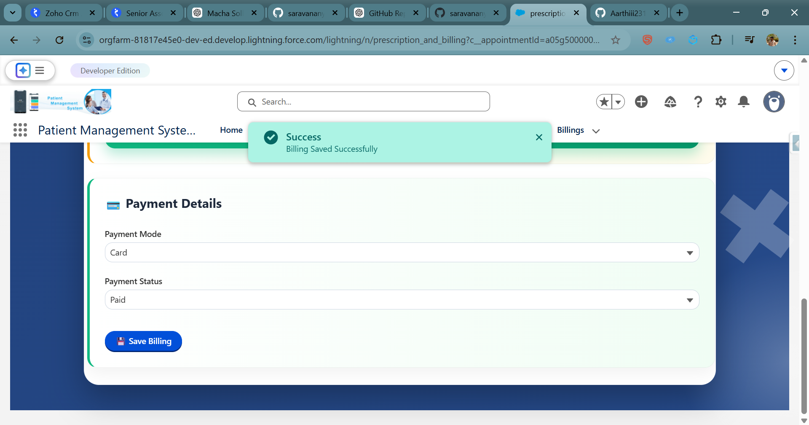

# Patient Management System

A Salesforce-based Patient Management System developed using 
Lightning Web Components (LWC) and Apex.

## Features
- Patient registration
- Doctor management
- Appointment booking
- Billing and prescription generation

## Technologies Used
- Salesforce
- Lightning Web Components (LWC)
- Apex
- JavaScript
- HTML
- CSS

## Modules
1. Patient Management
2. Doctor Management
3. Appointment Booking
4. Billing System

## Future Enhancements
- Online payment integration
- Email notifications
- AI disease prediction

## Project Screenshots

| Home | Booking | Booking2 |
|------|---------|----------|
|  |  |  |

| Appointment | Prescription | Billing |
|-------------|-------------|--------|
|  |  |  |

| Save |
|------|
|  |

